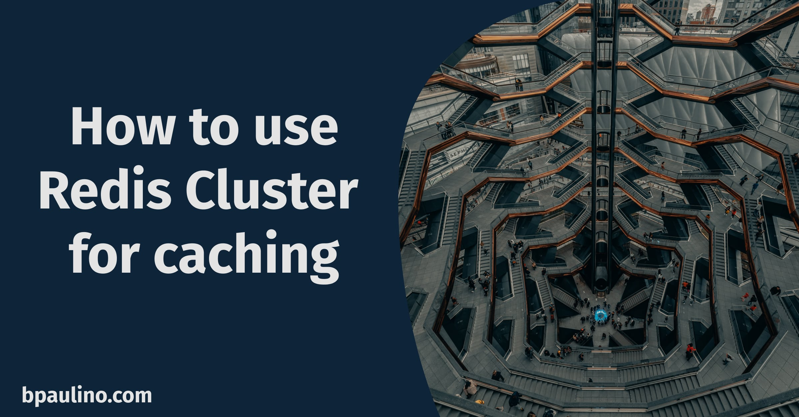

# Redis Cluster Demo

How to use a redis cluster with multiple shards using Docker and docker-compose. [You can read the full blogpost about this setup here.](https://bpaulino.com/entries/how-to-use-redis-cluster-for-caching)

> **Please note:**  This is not meant to be used in production, but for local development only.
> There is no point in using a Redis cluster in the same node using this docker-compose setup. If your node is down, your entire Redis cluster will be down.
